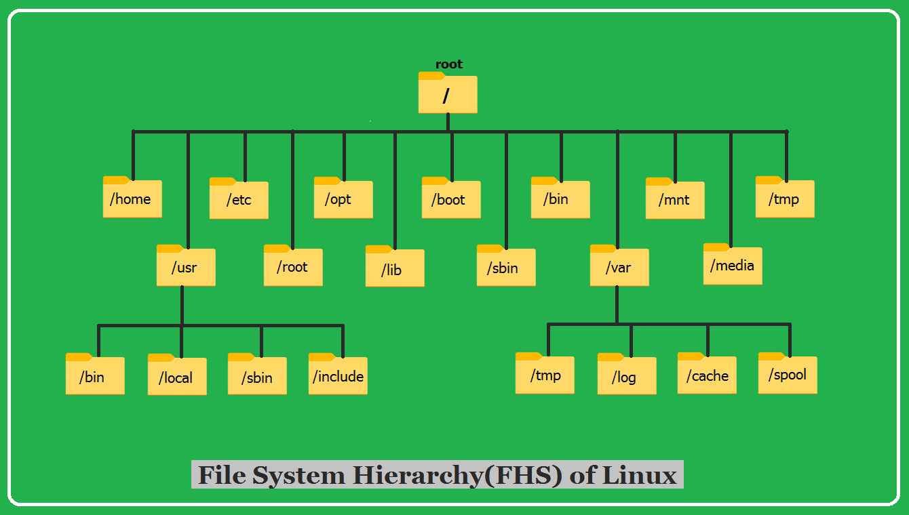

# Tu_Hoc_Linux

Repo này ghi lại quá trình học linux: [Linux](https://roadmap.sh/linux)

1. Điều hướng cơ bản
   
a) Các lệnh di chuyển cơ bản
   
   
   ```pwd```: Cho biết vị trí hiện tại
   * ```pwd```

   ```cd```: Để di chuyển sang các thư mục khác
   * ```cd Home```
   * ```cd ..```: lùi lại một thư mục

   ```ls```: Cho biết các file có trong thư mục
   * ```ls```
   * ```ls /home```
b) Di chuyển file

   ```mv```: Dùng để di chuyển hoặc đặt lại tệp tin hoặc thư 
   * ```mv file1.txt /path/to/destination/```: Chuyển file1 tới đường dẫn tương ứng
   * ```mv file1.txt file2.txt /path/to/destination/```: Chuyển nhiều file tới đường dẫn tương
   * ```mv file1.txt newfile.txt```: Rename file1 mà không di chuyển nó
   * ```mv -i file1.txt /path/to/destination/```: Kiểm tra xem có muốn thay thế file trùng không (y/n/Ctrl + c), i là viết tắt của
   * ```mv -u file1.txt /path/to/destination/```: Cập nhật file nếu file đó là phiên bản mới hơn, u là
   * ```mv -v file1.txt /path/to/destination/```: Hiển thị chi tiết các thay đổi, v là
   * ```mv -f file1.txt /path/to/destination/```: Ghi đè mà không cần, f là force
   * ```mv /source/directory/ /path/to/destination/```: Di chuyển directory được chọn tới đường dẫn tương ứng
   * ```mv --backup file1.txt /path/to/destination/```: Tạo một bản backup nếu trùng file trong đường dẫn tương ứng (bản backup sẽ có dấu ```~``` ở cuối)
   * ```mv --no-clobber file1.txt /path/to/destination/```: Không ghi đè nếu có file trùng

   ```cp```: copy file hoặc thư 
   * ```cp file1.txt backup.txt```: Copy file này và đổi tên trong cùng một thư
   * ```cp file1.txt /home/user/Documents/```: Copy file hiện tại vào thư mục
   * ```cp -r myfolder newfolder```: Copy một folder vào đường dẫn tương ứng, -r(recursion) là để copy folder
     
c) Tạo và xóa tệp tin hoặc thư mục 

   ```touch```: Tạo một tệp tin rỗng, tương tự như ```right click -> new -> text document``` bên windows
   * ```touch hello.txt```: Tạo file hello.txt

   ```mkdir```: Tạo một tệp tin mới, viết tắt của make directory
   * ```mkdir hello```
   * ```mkdir -p projects/python```: -p tạo một thư mục cha nếu nó không tồn tại

   ```rm```: Xóa 1 file hoặc thư mục (remove)
   * ```rm hello.txt```: Xóa 1 file
   * ```rm -r hello```: Xóa 1 thư
     
d) Cấu trúc thư mục hệ thống Linux 

   ```whoami```: In ra tên user đang dùng

   ```cat```: Xuất nội dung của file lên màn hình console, cat = concatenate
   * ```cat hello.txt```

   ```adduser```: Thêm 1 user mới 
   * ```adduser user_name```

   ```which```: Hiển thị dường dẫn đầy đủ của một lệnh
   * ```which ten_lenh```
   
   Mọi thứ trong Linux đều là một tệp tin

   

   * ```/```: Thư mục gốc của hệ thống
   * ```bin```: Chứa các file thực thi (Binary excutables), các chương trình có thể chạy được từ dòng
   * ```sbin```: Chứa các file thực thi của hệ
   * ```user```: Chứa dữ liệu và chương trình của người
   * ```boot```: File hệ
   * ```var```: Nơi chứa dữ liệu có thể thay đổi theo thời gian (variable data)
   * ```tmp```: Nơi chứa các file tạm (temporary)
   * ```lib```: Nơi chứa các thư viện hệ thống cần thiết để chạy các chương trình cơ
   * ```home```: Thư mục chứa các
   * ```root```: folder chứa user gốc
   * ```dev```: Đại diện cho các thiết bị của phần cứng dưới dạng device
   * ```etc```: Nơi chứa các file cấu hình của hệ thống
   * ```mnt``` và ```media```: Dùng để mount bằng tay các thiết cố định hoặc mount tự động cho các thiết bị 
   * ```opt```: 

